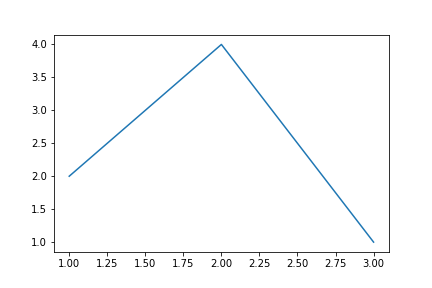
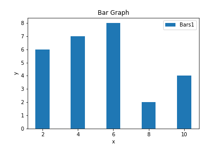
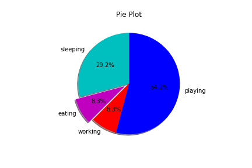

## Python

### Basic Introduction to Python

#### Origin

Python is a programming language that was created by Guido van Rossum in 1991. It was named after the British comedy group Monty Python. Python is a high-level programming language that is easy to read and write. It is also a general-purpose programming language that can be used for many different types of applications.

#### Features

Python is an interpreted language. This means that the code is not compiled into machine language before it is executed. Instead, the code is executed by an interpreter. The interpreter reads the code and executes it. Python is also an object-oriented programming language. This means that the code is organized into objects. These objects can contain data and code. Python is also a dynamically typed language. This means that the type of a variable is determined at runtime.

Features of Python:
Python provides many useful features which make it popular and valuable from the other programming languages. It supports object-oriented programming, procedural programming approaches and provides dynamic memory allocation.
some of the features of Python are :

1. Python is an interpreted language :
   Python is an interpreted language. It means that the Python code is executed by the interpreter. The interpreter reads the code line by line and executes it. It is not necessary to compile the code before executing it . This makes the process of executing the code faster and easier.

2. Python is a dynamically typed language :
   Python is a dynamically typed language. It means that the type of the variable is determined at runtime. It is not necessary to specify the type of the variable while declaring it. This makes the process of declaring the variables easier and faster.

3. Python is an object-oriented language :
   Python is an object-oriented language. It means that the Python code is organized into objects . The Object is a collection of data and methods that act on the data. The data in the object is called attributes and the methods are called as methods . the objects are created using classes. The class is a blueprint for the object .

4. Python is a general-purpose language :
   Python is a general-purpose language . It means that the Python can be used for any purpose . It can be used for web development, desktop application, game development, etc.

5. Python is a cross-platform language :
   Python is a cross-platform language. It means that the Python can be used on any platform . It can be used on Windows, Mac, Linux, etc.

6. Python is free and open-source :
   Python is free and open-source. It means that the Python is free to use and distribute. It is also open-source which means that the source code of the Python is available to everyone. Anyone can modify the source code and distribute it.

#### Applications of Python

Python is used in many fields. Some of the application of Python are :

1. Web Development :
   Python is used for web development. It is used for developing web applications. It is used for developing web frameworks like Django, Flask, etc.

2. Desktop Application :
   Python is used for developing desktop applications. It is used for developing GUI applications with the help of python libraries like Tkinter , PyQt, etc.

3. Game Development :
   Python is used for developing games. It is used for developing 2D games with the help of python libraries like Pygame, etc

4. Machine Learning :
   Python is used for developing machine learning applications. It is used for developing machine learning models with the help of python libraries like Scikit-learn, Tensorflow, etc.

5. Data Science :
   Python is used for developing data science applications. It is used for developing data science applications with the help of python libraries like Numpy, Pandas, Matplotlib, etc.

6. Image Processing :
   Python is used for developing image processing applications. It is used for developing image processing applications with the help of python libraries like OpenCV, etc.

### Program Structure

Python programs are organized into modules. A module is a file that contains Python code. Modules can be imported into other modules.

```python
import module_name  # This imports the module
```

Modules can also be executed directly.

```python
code:
    def function_name():
        print("Hello World")
    if __name__ == "__main__": # This is the main module
        function_name()
output:
    Hello World
```

Python programs are also organized into statements. A statement is a unit of code that the Python interpreter can execute. Statements are terminated by a newline character.

```python
print("Hello World")   # This is a statement
```

Python programs are also organized into blocks. A block is a section of code that is grouped together. Blocks are delimited by indentation.

```python
if True:        # This a block
    print("Hello World")
```

### Identifiers

Python uses identifiers to name variables, functions, classes, modules, and other objects . An identifier must start with a letter or underscore. It can contain letters, numbers, and underscores. It is case sensitive. Python does not allow punctuation characters such as `@` , `$` , and `%` within identifiers.

```python
_hi = 10        # This is valid
_ = 20          # This is valid
my_var = 10     # This is valid
2my_var = 10    # This is invalid
@my_var = 10    # This is invalid
var = 10        # This is valid
```

### Reserved Words

Python has a set of reserved words that cannot be used as identifiers. These words are used to define the syntax and structure of the Python language.

```python
False       class       is          return
None        continue    for         try
True        def         from        while
and         del         global      not
with        as          elif        if
or          else        import      pass
break       except      in          raise
```

### Escape Sequences

Python uses escape sequences to represent certain whitespace characters. These characters cannot be typed directly into a string. The escape sequences are:

```python
\'      Single quote
\"      Double quote
\\      Backslash
\n      Newline
\t      Tab
\r      Carriage return
\b      Backspace
```

#### Variables and assignment statements

Variables are used to store data values. A variable is created the first time it is assigned a value.

The equal sign `=` is used to assign a value to a variable. The value is stored in the variable.

```python
my_var = 10     # This assigns the value 10 to the variable my_var
```

## Data Types

Python has five standard data types:

- Numbers
  Numbers are used to store numeric values. Python supports four different numerical types:
  1. int (signed integers)
  2. long (long integers, they can also be represented in octal and hexadecimal)
  3. float (floating point real values)
  4. complex (complex numbers)
  ```python
  example:
    signed_int = 10     # This is a signed integer
    long_int = 10L      # This is a long integer
    my_float = 10.0     # This is a float
    my_complex = 10j    # This is a complex number
  ```
- String
  Strings are used to store textual data. Strings can be enclosed in single quotes or double quotes.
  ```python
  example:
      my_string = "Hello World"   # This is a string
      single_quotes = 'Hello World'   # This is also a string
  ```
- List
  Lists are used to store a sequence of values. Lists are enclosed in square brackets. `[ ]`.
  ```python
  example:
      my_list = [1, 2, 3]     # This is a list
  ```
- Tuple
  Tuples are used to store a sequence of values. Tuple are enclosed in parentheses.`( )`.
  ```python
  example:
      my_tuple = (1, 2, 3)    # This is a tuple
  ```
- Dictionary
  Dictionaries are used to store data values in key:value pairs. Dictionaries are enclosed in curly braces. `{ }`.
  ```python
  example:
      my_dict = {"key1": 1, "key2": 2, "key3": 3}    # This is a dictionary
  ```

#### Operators

Python supports the following types of operators:

- Arithmetic operators
  Arithmetic operators are used with numeric values to perform common mathematical operations.

  ```python
  example:
      addition = 10 + 5      # This is addition
      subtraction = 10 - 5   # This is subtraction
      multiplication = 10 * 5    # This is multiplication
      division = 10 / 5      # This is division
      modulus = 10 % 5       # This is modulus
      exponent = 10 ** 5     # This is exponentiation
      floor_division = 10 // 5   # This is floor division
  ```

- Assignment operators
  Assignment operators are used to assign values to variables.

  ```python
  example:
      x = 10      # This is an assignment operator
      x += 5      # This is an augmented assignment operator
      x -= 5      # This is an augmented assignment operator
      x *= 5      # This is an augmented assignment operator
      x /= 5      # This is an augmented assignment operator
      x %= 5      # This is an augmented assignment operator
      x **= 5     # This is an augmented assignment operator
      x //= 5     # This is an augmented assignment operator

  ```

- Comparison operators
  Comparison operators are used to compare two values.

  ```python
  example:
      x = 10
      y = 5
      x == y      # This is an equality operator
      x != y      # This is an inequality operator
      x > y       # This is a greater than operator
      x < y       # This is a less than operator
      x >= y      # This is a greater than or equal to operator
      x <= y      # This is a less than or equal to operator
  ```

- Logical operators
  Logical operators are used to combine conditional statements.

  ```python
  example:
      x = 10
      y = 5
      x > 5 and y > 5     # This is an and operator
      x > 5 or y > 5      # This is an or operator
      not(x > 5 and y > 5)    # This is a not operator
  ```

- Identity operators/ Membership operators
  Identity operators are used to compare the objects, not if they are equal, but if they are actually the same object, with the same memory location.

  ```python
  example:
      x = 10
      y = 5
      x is y      # This is an is operator
      x is not y  # This is an is not operator
  ```

- Bitwise operators
  Bitwise operators are used to compare (binary) numbers.

  ```python
  example:
      x = 10
      y = 5
      x & y       # This is a bitwise and operator
      x | y       # This is a bitwise or operator
      x ^ y       # This is a bitwise xor operator
      ~x          # This is a bitwise not operator
      x << 2      # This is a bitwise left shift operator
      x >> 2      # This is a bitwise right shift operator
  ```

## Control Structures

Control structures are used to change the flow of execution of a program.

Python supports the following control structures:

1. Conditional statements
2. Looping statements
3. Jump statements

### Conditional Statements

Conditional statements are used to perform different actions based on different conditions.

Python supports the following conditional statements:

1. If statement
   If statement is used to execute a block of code if a condition is true.
   ```python
   syntax:
       if condition:
           # code block
   ```
   ```python
   example:
       x = 10
       if x > 5:
           print("x is greater than 5")
   ```
2. If...else statement
   If...else statement is used to execute a block of code if a condition is true. If the condition is false, another block of code can be executed.

   ```python
   syntax:
       if condition:
           # code block
       else:
           # code block
   ```

   ```python
   example:
       x = 10
       if x > 5:
           print("x is greater than 5")
       else:
           print("x is less than or equal to 5")
   ```

3. If...elif...else statement
   If...elif...else statement is used to execute a different block of code for more than two conditions.
   ```python
   syntax:
       if condition:
           # code block
       elif condition:
           # code block
       else:
           # code block
   ```
   ```python
   example:
       x = 10
       if x > 5:
           print("x is greater than 5")
       elif x < 5:
           print("x is less than 5")
       else:
           print("x is equal to 5")
   ```

##### Looping Statements

Looping statements are used to execute a block of code multiple times.

Python supports the following looping statements:

1. For loop
   For loop is used to iterate over a sequence (list, tuple, string) or other iterable objects.

   ```python
   syntax:
       for item in iterable:
           # code block
   ```

   ```python
   example:
       my_list = [1, 2, 3]
       for item in my_list:
           print(item)
   ```

2. While loop
   While loop is used to execute a set of statements as long as a condition is true.
   ```python
   syntax:
       while condition:
           # code block
   ```
   ```python
   example:
       x = 10
       while x > 0:
           print(x)
           x -= 1
   ```
3. Nested loops
   Nested loops are loops inside loops.

   ```python
   example:
       for i in range(1, 4):
           for j in range(1, 4):
               print(i, j)
   ```

4. Else statement
   Else statement can be used with for and while loops.
   ```python
   syntax:
       for item in iterable:
           # code block
       else:
           # code block
   ```
   ```python
   example:
       for i in range(1, 4):
           for j in range(1, 4):
               print(i, j)
       else:
           print("Loop ended")
   ```

##### Jump Statements

Jump statements are used to transfer the control to another part of the program.

Python supports the following jump statements:

1. Break statement
   Break statement is used to exit or break a loop.
   ```python
   example:
       for i in range(1, 4):
           for j in range(1, 4):
               print(i, j)
               if i == 2 and j == 2:
                   break
   ```
2. Continue statement
   Continue statement is used to skip the current iteration of the loop, and continue with the next.
   ```python
   example:
       for i in range(1, 4):
           for j in range(1, 4):
               if i == 2 and j == 2:
                   continue
               print(i, j)
   ```
3. Pass statement
   Pass statement is a null statement. The difference between a comment and a pass statement in Python is that while the interpreter ignores a comment entirely, pass is not ignored.
   ```python
   example:
       for i in range(1, 4):
           for j in range(1, 4):
               if i == 2 and j == 2:
                   pass
               print(i, j)
   ```
4. Return statement
   Return statement is used to end the execution of the function call and "returns" the result (value of the expression following the return keyword) to the caller. The statements after the return statements are not executed.
   ```python
   example:
        def my_function():
             return 10
        print(my_function())
   ```
5. Yield statement

   Yield statement is used to end the execution of the function call and "returns" the result (value of the expression following the yield keyword) to the caller. The difference is that the next time you call the function, it will continue from the last yield statement.

   ```python
   example:
         def my_function():
                yield 10
                   yield 20
         yeild_obj = my_function()
           print(next(yeild_obj))
           print(next(yeild_obj))
   ```

6. Raise statement
   Raise statement is used to raise an exception.
   ```python
   example:
       x = -1
       if x < 0:
           raise Exception("Sorry, no numbers below zero")
   ```
7. Assert statement
   Assert statement is used for debugging purposes.

   ```python
   example:
        x = -1
        assert (x >= 0), "x is not positive"
   ```

8. Try statement
   Try statement is used to catch and handle exceptions. Python has many built-in exceptions, and if you do not know what exception you got, you can use a generic except statement to catch all exceptions.

   ```python
   syntax:
       try:
           # code block
       except:
           # code block
   ```

   ```python
   example:
       try:
           print(x)
       except:
           print("An exception occurred")
   ```

9. Finally statement
   Finally statement is used to execute a block of code, regardless if there was an exception or not.

   ```python
   syntax:
       try:
           # code block
       except:
           # code block
       finally:
           # code block
   ```

   ```python
   example:
       try:
           print(x)
       except:
           print("An exception occurred")
       finally:
           print("The 'try except' is finished")
   ```

10. With statement
    With statement is used to wrap the execution
    of a block with methods defined by the context manager. The context manager handles the entry into, and the exit from, the desired runtime context for the execution of the block.
    ```python
    format:
        with expression as target:
            # code block
    ```
    ```python
    example:
        with open("test.txt") as f:
            f.write("Hello World")
    ```

## Strings

Strings are used to store text. Strings in Python are surrounded by either single quotation marks, or double quotation marks.

```python
example:
    my_string = "Hello World"
    print(my_string)
```

##### String Methods

Python has a set of built-in methods that you can use on strings.

Python Support the following string methods:

1. Count
   Returns the number of times a specified value occurs in a string
   ```python
   syntax:
       string.count(value, start, end)
   ```
   ```python
   example:
       my_string = "Hello World"
       print(my_string.count("l"))
   ```
2. Find
   Searches the string for a specified value and returns the position of where it was found
   ```python
   syntax:
        string.find(value, start, end)
   ```
   ```python
   example:
        my_string = "Hello World"
        print(my_string.find("l"))
   ```
3. Replace
   Returns a string where a specified value is replaced with a specified value
   ```python
   syntax:
        string.replace(oldvalue, newvalue, count)
   ```
   ```python
   example:
        my_string = "Hello World"
        print(my_string.replace("l", "p"))
   ```
4. Split
   Splits the string at the specified separator, and returns a list
   ```python
   syntax:
        string.split(separator, maxsplit)
   ```
   ```python
   example:
        my_string = "Hello World"
        print(my_string.split(" "))
   ```
5. Join
   Joins the elements of an iterable to the end of the string
   ```python
   syntax:
        string.join(iterable)
   ```
   ```python
   example:
        my_string = "Hello World"
        print(" ".join(my_string))
   ```
6. Lower
   Converts a string into lower case
   ```python
   syntax:
        string.lower()
   ```
   ```python
   example:
        my_string = "Hello World"
        print(my_string.lower())
   ```
7. Upper
   Converts a string into upper case
   ```python
   syntax:
        string.upper()
   ```
   ```python
   example:
        my_string = "Hello World"
        print(my_string.upper())
   ```
8. Strip
   Returns a trimmed version of the string
   ```python
   syntax:
        string.strip(characters)
   ```
   ```python
   example:
        my_string = "Hello World"
        print(my_string.strip("H"))
   ```
9. Startswith
   Returns true if the string starts with the specified value
   ```python
   syntax:
        string.startswith(value, start, end)
   ```
   ```python
   example:
        my_string = "Hello World"
        print(my_string.startswith("H"))
   ```
10. Endswith
    Returns true if the string ends with the specified value
    ```python
    syntax:
         string.endswith(value, start, end)
    ```
    ```python
    example:
         my_string = "Hello World"
         print(my_string.endswith("d"))
    ```
11. Capitalize
    Converts the first character to upper case
    ```python
    syntax:
         string.capitalize()
    ```
    ```python
    example:
         my_string = "Hello World"
         print(my_string.capitalize())
    ```

## Lists

Lists are used to store multiple items in a single variable. Lists are one of 4 built-in data types in Python used to store collections of data, the other 3 are Tuple, Set, and Dictionary, all with different qualities and usage.

```python
example:
    my_list = ["apple", "banana", "cherry"]
    print(my_list)
```

##### Difference between Mutable and Immutable objects

| Mutable                                                | Immutable                                                   |
| ------------------------------------------------------ | ----------------------------------------------------------- |
| Mutable objects can be changed after they are created. | Immutable objects cannot be changed after they are created. |
| Mutable objects don't have a hash value.               | Immutable objects have a hash value.                        |
| Mutable objects are slower than immutable objects.     | Immutable objects are faster than mutable objects.          |
| Mutable objects can be used as dictionary keys.        | Immutable objects cannot be used as dictionary keys.        |
| Mutable objects can be used as set members.            | Immutable objects cannot be used as set members.            |
| examples: list, dict, set, byte array                  | examples: int, float, complex, string, tuple, range         |

##### List Methods

Python has a set of built-in methods that you can use on lists.

Python Support the following list methods:

1. Concatenation
   Combines two lists

   ```python
   syntax:
       list1 + list2
   ```

   ```python
   example:
       list1 = ["a", "b" , "c"]
       list2 = [1, 2, 3]
       print(list1 + list2)
   ```

   output:

   ```python
   ['a', 'b', 'c', 1, 2, 3]
   ```

2. Repeat
   Repeats the elements of a list a specified number of times

   ```python
   syntax:
       list * number
   ```

   ```python
   example:
       list1 = ["a", "b" , "c"]
       print(list1 * 3)
   ```

   output:

   ```python
   ['a', 'b', 'c', 'a', 'b', 'c', 'a', 'b', 'c']
   ```

3. In operator
   Returns True if a specified item is present in a list
   ```python
   syntax:
       value in list
   ```
   ```python
   example:
       list1 = ["a", "b" , "c"]
       print("a" in list1)
   ```
   output:
   ```python
    True
   ```
4. Not in operator
   Returns True if a specified item is not present in a list
   ```python
   syntax:
       value not in list
   ```
   ```python
   example:
       list1 = ["a", "b" , "c"]
       print("d" not in list1)
   ```
   output:
   ```python
    True
   ```
5. Max
   Returns the largest item in a list
   ```python
   syntax:
       max(list)
   ```
   ```python
   example:
       list1 = [1, 2, 3]
       print(max(list1))
   ```
   output:
   ```python
    3
   ```
6. Min
   Returns the smallest item in a list
   ```python
   syntax:
        min(list)
   ```
   ```python
   example:
        list1 = [1, 2, 3]
        print(min(list1))
   ```
   output:
   ```python
    1
   ```
7. Len
   Returns the number of items in a list
   ```python
   syntax:
        len(list)
   ```
   ```python
   example:
        list1 = [1, 2, 3]
        print(len(list1))
   ```
   output:
   ```python
    3
   ```
8. Sum
   Returns the sum of all items in a list
   ```python
   syntax:
         sum(list)
   ```
   ```python
   example:
         list1 = [1, 2, 3]
         print(sum(list1))
   ```
   output:
   ```python
    6
   ```
9. All
   Returns True if all items in a list are true
   ```python
   syntax:
         all(list)
   ```
   ```python
   example:
         list1 = [1, 2, 3]
         print(all(list1))
   ```
   output:
   ```python
    True
   ```
10. Any
    Returns True if any item in a list is true
    ```python
    syntax:
          any(list)
    ```
    ```python
    example:
          list1 = [1, 2, 3]
          print(any(list1))
    ```
    output:
    ```python
     True
    ```
11. Append
    Adds an element at the end of the list
    ```python
    syntax:
          list.append(element)
    ```
    ```python
    example:
          list1 = [1, 2, 3]
          list1.append(4)
          print(list1)
    ```
    output:
    ```python
     [1, 2, 3, 4]
    ```
12. Extend
    Add the elements of a list (or any iterable), to the end of the current list

    ```python
    syntax:
          list.extend(iterable)
    ```

    ```python
    example:
          list1 = [1, 2, 3]
          list2 = [4, 5, 6]
          list1.extend(list2)
          print(list1)
    ```

    output:

    ```python
     [1, 2, 3, 4, 5, 6]
    ```

13. Count
    Returns the number of elements with the specified value
    ```python
    syntax:
          list.count(element)
    ```
    ```python
    example:
          list1 = [1, 2, 3, 4, 5, 6, 7, 8, 9, 10]
          print(list1.count(5))
    ```
    output:
    ```python
     1
    ```
14. Remove
    Removes the first item with the specified value
    ```python
    syntax:
          list.remove(element)
    ```
    ```python
    example:
          list1 = [1, 2, 3, 4, 5, 6, 7, 8, 9, 10]
          list1.remove(5)
          print(list1)
    ```
    output:
    ```python
     [1, 2, 3, 4, 6, 7, 8, 9, 10]
    ```
15. Pop
    Removes the element at the specified position
    ```python
    syntax:
          list.pop(index)
    ```
    ```python
    example:
          list1 = [1, 2, 3, 4, 5, 6, 7, 8, 9, 10]
          list1.pop(5)
          print(list1)
    ```
    output:
    ```python
     [1, 2, 3, 4, 5, 7, 8, 9, 10]
    ```
16. Index
    Returns the index of the first element with the specified value
    ```python
    syntax:
          list.index(element)
    ```
    ```python
    example:
          list1 = [1, 2, 3, 4, 5, 6, 7, 8, 9, 10]
          print(list1.index(5))
    ```
    output:
    ```python
     4
    ```
17. Insert
    Adds an element at the specified position
    ```python
    syntax:
          list.insert(index, element)
    ```
    ```python
    example:
          list1 = [1, 2, 3, 4, 5, 6, 7, 8, 9, 10]
          list1.insert(5, 11)
          print(list1)
    ```
    output:
    ```python
     [1, 2, 3, 4, 5, 11, 6, 7, 8, 9, 10]
    ```
18. Reverse
    Reverses the order of the list
    ```python
    syntax:
          list.reverse()
    ```
    ```python
    example:
          list1 = [1, 2, 3, 4, 5, 6, 7, 8, 9, 10]
          list1.reverse()
          print(list1)
    ```
    output:
    ```python
     [10, 9, 8, 7, 6, 5, 4, 3, 2, 1]
    ```
19. Sort
    Sorts the list
    ```python
    syntax:
          list.sort()
    ```
    ```python
    example:
          list1 = [1, 2, 3, 4, 5, 6, 7, 8, 9, 10]
          list1.sort()
          print(list1)
    ```
    output:
    ```python
     [1, 2, 3, 4, 5, 6, 7, 8, 9, 10]
    ```

## Tuple

A tuple is a collection which is ordered and unchangeable. In Python tuples are written with round brackets.

```python
syntax:
     tuple = (element1, element2, element3, ...)
```

```python
example:
     tuple1 = (1, 2, 3)
     print(tuple1)
```

output:

```python
 (1, 2, 3)
```

### Access Tuple Items

You can access tuple items by referring to the index number, inside square brackets:

```python
syntax:
      tuple[index]
```

```python
example:
      tuple1 = (1, 2, 3)
      print(tuple1[1])
```

output:

```python
 2
```

#### Change Tuple Values

Once a tuple is created, you cannot change its values. Tuples are unchangeable, or immutable as it also is called.

```python
syntax:
      tuple[index] = new_value
```

```python
example:
      tuple1 = (1, 2, 3)
      tuple1[1] = 4
      print(tuple1)
```

output:

```python
 TypeError: 'tuple' object does not support item assignment
```

#### Loop Through a Tuple

You can loop through the tuple items by using a for loop.

```python
syntax:
      for x in tuple:
           print(x)
```

```python
example:
      tuple1 = (1, 2, 3)
      for x in tuple1:
           print(x)
```

output:

```python
 1
 2
 3
```

#### Check if Item Exists

To determine if a specified item is present in a tuple use the in keyword:

```python
syntax:
      if element in tuple:
           print("Yes")
      else:
           print("No")
```

```python
example:
      tuple1 = (1, 2, 3)
      if 4 in tuple1:
           print("Yes")
      else:
           print("No")
```

output:

```python
 No
```

#### Tuple Length

To determine how many items a tuple has, use the len() method:

```python
syntax:
      len(tuple)
```

```python
example:
      tuple1 = (1, 2, 3)
      print(len(tuple1))
```

output:

```python
 3
```

#### Tuple Concatenation

To concatenate, or combine, two tuples you can use the + operator:

```python
syntax:
      tuple1 + tuple2
```

```python
example:
      tuple1 = (1, 2, 3)
      tuple2 = (4, 5, 6)
      print(tuple1 + tuple2)
```

output:

```python
 (1, 2, 3, 4, 5, 6)
```

#### Tuple Repetition

To create a tuple with the same item, multiple times, you can use the \* operator:

```python
syntax:
      tuple * number
```

```python
example:
      tuple1 = (1, 2, 3)
      print(tuple1 * 3)
```

output:

```python
 (1, 2, 3, 1, 2, 3, 1, 2, 3)
```

#### Tuple membership

To determine if a specified item is present in a tuple use the in keyword:

```python
syntax:
      if element in tuple:
           print("Yes")
      else:
           print("No")
```

```python
example:
      tuple1 = (1, 2, 3)
      if 4 in tuple1:
           print("Yes")
      else:
           print("No")
```

output:

```python
 No
```

#### Tuple max

To determine the largest item in a tuple use the max() method:

```python
syntax:
        max(tuple)
```

```python
example:
        tuple1 = (1, 2, 3)
        print(max(tuple1))
```

output:

```python
    3
```

#### Tuple min

To determine the smallest item in a tuple use the min() method:

```python
syntax:
        min(tuple)
```

```python
example:
        tuple1 = (1, 2, 3)
        print(min(tuple1))
```

output:

```python
    1
```

#### Tuple Count

To determine how many times a specified value occurs in a tuple use the count() method:

```python
syntax:
        tuple.count(element)
```

```python
example:
        tuple1 = (1, 2, 3, 1, 2, 3)
        print(tuple1.count(1))
```

output:

```python
    2
```

#### Tuple Index

To determine the index of the first occurrence of a specified value in a tuple use the index() method:

```python
syntax:
        tuple.index(element)
```

```python
example:
        tuple1 = (1, 2, 3, 1, 2, 3)
        print(tuple1.index(1))
```

output:

```python
    0
```

## Dictionary

1. Dictionary
   A dictionary is a collection which is unordered, changeable and indexed. In Python dictionaries are written with curly brackets, and they have keys and values.

   ```python
   syntax:
        dictionary = {key1: value1, key2: value2, key3: value3, ...}
   ```

   ```python
   example:
        dict1 = {"name": "John", "age": 36}
        print(dict1)
   ```

   output:

   ```python
    {'name': 'John', 'age': 36}
   ```

2. Access Dictionary Items
   You can access the items of a dictionary by referring to its key name, inside square brackets:
   ```python
   syntax:
         dictionary[key]
   ```
   ```python
   example:
         dict1 = {"name": "John", "age": 36}
         print(dict1["name"])
   ```
   output:
   ```python
    John
   ```
3. Change Dictionary Items
   You can change the value of a specific item by referring to its key name:
   ```python
   syntax:
         dictionary[key] = new_value
   ```
   ```python
   example:
         dict1 = {"name": "John", "age": 36}
         dict1["age"] = 40
         print(dict1)
   ```
   output:
   ```python
    {'name': 'John', 'age': 40}
   ```
4. Loop Through a Dictionary
   You can loop through a dictionary by using a for loop.
   ```python
   syntax:
         for x in dictionary:
              print(x)
   ```
   ```python
   example:
         dict1 = {"name": "John", "age": 36}
         for x in dict1:
              print(x)
   ```
   output:
   ```python
    name
    age
   ```
5. Check if Key Exists
   To determine if a specified key is present in a dictionary use the in keyword:
   ```python
   syntax:
         if key in dictionary:
              print("Yes")
         else:
              print("No")
   ```
   ```python
   example:
         dict1 = {"name": "John", "age": 36}
         if "name" in dict1:
              print("Yes")
         else:
              print("No")
   ```
   output:
   ```python
    Yes
   ```
6. Dictionary Length
   To determine how many items (key-value pairs) a dictionary has, use the len() method:
   ```python
   syntax:
         len(dictionary)
   ```
   ```python
   example:
         dict1 = {"name": "John", "age": 36}
         print(len(dict1))
   ```
   output:
   ```python
    2
   ```
7. Adding Items
   Adding an item to the dictionary is done by using a new index key and assigning a value to it:
   ```python
   syntax:
         dictionary[key] = value
   ```
   ```python
   example:
         dict1 = {"name": "John", "age": 36}
         dict1["country"] = "Norway"
         print(dict1)
   ```
   output:
   ```python
    {'name': 'John', 'age': 36, 'country': 'Norway'}
   ```
8. Removing Items
   There are several methods to remove items from a dictionary:
   ```python
   syntax:
         dictionary.pop(key)
         dictionary.popitem()
         del dictionary[key]
         dictionary.clear()
   ```
   ```python
   example:
         dict1 = {"name": "John", "age": 36}
         dict1.pop("age")
         print(dict1)
   ```
   output:
   ```python
    {'name': 'John'}
   ```
9. Copy a Dictionary
   You cannot copy a dictionary simply by typing dict2 = dict1, because: dict2 will only be a reference to dict1, and changes made in dict1 will automatically also be made in dict2.
   There are ways to make a copy, one way is to use the built-in Dictionary method copy().
   ```python
   syntax:
         dict2 = dict1.copy()
   ```
   ```python
   example:
         dict1 = {"name": "John", "age": 36}
         dict2 = dict1.copy()
         print(dict2)
   ```
   output:
   ```python
    {'name': 'John', 'age': 36}
   ```
10. Nested Dictionaries
    A dictionary can also contain many dictionaries, this is called nested dictionaries.
    ```python
    syntax:
          dictionary = {key1: {key1: value1, key2: value2}, key2: {key1: value1, key2: value2}}
    ```
    ```python
    example:
          dict1 = {
               "child1": {
                    "name": "Emil",
                    "year": 2004
               },
               "child2": {
                    "name": "Tobias",
                    "year": 2007
               },
               "child3": {
                    "name": "Linus",
                    "year": 2011
               }
          }
          print(dict1)
    ```
    output:
    ```python
     {'child1': {'name': 'Emil', 'year': 2004}, 'child2': {'name': 'Tobias', 'year': 2007}, 'child3': {'name': 'Linus', 'year': 2011}}
    ```
11. Dictionary Methods
    Python has a set of built-in methods that you can use on dictionaries.
    Method | Description
    --- | ---
    clear() | Removes all the elements from the dictionary
    copy() | Returns a copy of the dictionary
    fromkeys() | Returns a dictionary with the specified keys and value
    get() | Returns the value of the specified key
    items() | Returns a list containing a tuple for each key value pair
    keys() | Returns a list containing the dictionary's keys
    pop() | Removes the element with the specified key
    popitem() | Removes the last inserted key-value pair
    setdefault() | Returns the value of the specified key. If the key does not exist: insert the key, with the specified value
    update() | Updates the dictionary with the specified key-value pairs
    values() | Returns a list of all the values in the dictionary

## Functions

##### What is a Function?

A function is a block of code which only runs when it is called.
You can pass data, known as parameters, into a function.
A function can return data as a result.

```python
syntax:
        def function_name(parameters):
            function_body
```

```python
example:
        def my_function():
            print("Hello from a function")
        my_function()
```

output:

```python
    Hello from a function
```

### Arguments

Information can be passed into functions as arguments.
Arguments are specified after the function name, inside the parentheses. You can add as many arguments as you want, just separate them with a comma.
The following example has a function with one argument (fname). When the function is called, we pass along a first name, which is used inside the function to print the full name:

```python
syntax:
        def function_name(parameters):
            function_body
```

```python
example:
        def my_function(fname):
            print(fname + " Refsnes")
        my_function("Emil")
        my_function("Tobias")
        my_function("Linus")
```

output:

```python
    Emil Refsnes
    Tobias Refsnes
    Linus Refsnes
```

### Parameters or Arguments?

The terms parameter and argument can be used for the same thing: information that are passed into a function.
From a function's perspective:
A parameter is the variable listed inside the parentheses in the function definition.
An argument is the value that is sent to the function when it is called.

```python
syntax:
        def function_name(parameters):
            function_body
```

```python
example:
        def my_function(fname):
            print(fname + " Refsnes")
        my_function("Emil")
        my_function("Tobias")
        my_function("Linus")
```

output:

```python
    Emil Refsnes
    Tobias Refsnes
    Linus Refsnes
```

#### Return Values

To let a function return a value, use the return statement:

```python
syntax:
        def function_name(parameters):
            function_body
```

```python
example:
        def my_function(x):
            return 5 * x
        print(my_function(3))
        print(my_function(5))
        print(my_function(9))
```

output:

```python
    15
    25
    45
```

#### Types of Functions

1. Built-in Functions
   Python has a set of built-in functions, including print(), input(), etc.
   ```python
   example:
         x = abs(-7.25)
         print(x)
   ```
   output:
   ```python
    7.25
   ```
2. User-defined Functions
   You can create your own functions with the def keyword.
   ```python
   syntax:
         def function_name(parameters):
              function_body
   ```
   ```python
   example:
         def my_function():
              print("Hello from a function")
         my_function()
   ```
   output:
   ```python
    Hello from a function
   ```
3. Anonymous Functions
   Anonymous functions are also called lambda functions.
   ```python
   syntax:
         lambda arguments : expression
   ```
   ```python
   example:
         x = lambda a : a + 10
         print(x(5))
   ```
   output:
   ```python
    15
   ```
4. Recursion
   Python also accepts function recursion, which means a defined function can call itself.
   ```python
   syntax:
         def function_name(parameters):
              function_body
   ```
   ```python
   example:
         def tri_recursion(k):
              if(k > 0):
                   result = k + tri_recursion(k - 1)
                   print(result)
              else:
                   result = 0
              return result
         print("\n\nRecursion Example Results")
         tri_recursion(6)
   ```
   output:
   ```python
    1
    3
    6
    10
    15
    21
    28
   ```

#### Formal vs. Actual Arguments

Formal arguments are the arguments specified in the function definition.<br>
Actual arguments are the values passed to the function during function call.

```python
syntax:
        def function_name(parameters): # This is formal argument
            function_body
```

```python
example:
        def my_function(fname):
            print(fname )
        my_function("Kanishk") # This is actual argument
```

output:

```python
    Kanishk
```

### Scope and Lifetime of Variables

A variable is only available from inside the region it is created. This is called scope.

```python
syntax:
        def function_name(parameters):
            function_body
```

```python
example:
        def myfunc():
          x = 300
          print(x)
        myfunc()
```

output:

```python
    300
```

#### Lifetime of a Variable

The lifetime of a variable is the period throughout which the variable exits in the memory. The lifetime of variables inside a function is as long as the function executes.

```python
syntax:
        def function_name(parameters):
            function_body
```

```python
example:
        def myfunc():
          x = 300
          print(x)
        myfunc()
```

output:

```python
    300
```

#### Keyword Arguments

You can also send arguments with the key = value syntax.
This way the order of the arguments does not matter.

```python
syntax:
        def function_name(parameters):
            function_body
```

```python
example:
    def Name(name, age):
        print(name, "is", age, "years old.")
    Name(age = 19, name = "Kanishk") # Here age and name are keyword arguments
```

output:

```python
    The youngest child is Linus
```

#### Default Arguments

If we call the function without argument, it uses the default value.

```python
syntax:
        def function_name(parameters):
            function_body
```

```python
example:
    def Name(name, age = 19):
        print(name, "is", age, "years old.")
    Name(name = "Kanishk") # Here age is default argument
```

#### Recursion

Recursion is a process of repeating items in a self-similar way. In programming, if a function calls itself, it is called recursion and the corresponding function is called as recursive function. The idea is to represent a problem in terms of one or more smaller problems, and add one or more base conditions that stop the recursion.

```python
syntax:
        def function_name(parameters):
            function_body
```

```python
example:
    def Recursion(k):
        if(k > 0):
            result = k + Recursion(k - 1)
            print(result)
        else:
            result = 0
        return result

    Recursion(6)
```

output:

```python
1
3
6
10
15
21
```

### Modules

Consider a module to be the same as a code library.
A file containing a set of functions you want to include in your application.
To create a module just save the code you want in a file with the file extension .py

```python
syntax:
    import module_name

    module_name.function_name()

```

```python
example:
    import mymodule
    mymodule.greeting("Kanishk")
```

#### Math Module

The math module has a set of built-in methods that allows you to perform mathematical tasks on numbers.

```python
example:
    import math
    x = math.sqrt(64)
    print(x)
```

output:

```python
    8.0
```

##### Math Module Functions

| Function       | Description                                             |
| -------------- | ------------------------------------------------------- |
| math.ceil(x)   | Returns the smallest integer greater than or equal to x |
| math.floor(x)  | Returns the largest integer less than or equal to x     |
| math.sqrt(x)   | Returns the square root of x                            |
| math.pow(x, y) | Returns x raised to the power y                         |
| math.pi        | Returns the value of PI                                 |
| math.e         | Returns the value of E                                  |
| math.sin(x)    | Returns the sine of x (x is in radians)                 |
| math.cos(x)    | Returns the cosine of x (x is in radians)               |
| math.tan(x)    | Returns the tangent of x (x is in radians)              |
| math.log(x)    | Returns the natural logarithm of x, for x > 0           |

#### Random Module

The random module can be used to generate random numbers.

```python
example:
    import random
    print(random.randrange(1, 10))
```

output:

```python
    random number between 1 and 10
```

##### Random Module Functions

| Function                            | Description                                                                           |
| ----------------------------------- | ------------------------------------------------------------------------------------- |
| random.randrange(start, stop, step) | Returns a randomly selected element from range(start, stop, step)                     |
| random.randint(start, stop)         | Returns a randomly selected element from range(start, stop+1)                         |
| random.choice(seq)                  | Returns a randomly selected element from the non-empty sequence seq                   |
| random.shuffle(lst)                 | Shuffles the elements of the list lst                                                 |
| random.random()                     | Returns a random float r, such that 0 is less than or equal to r and r is less than 1 |

### Creating your own Modules

To create a module just save the code you want in a file with the file extension .py

```python
example:
    def greeting(name):
        print("Hello, " + name)
```

to use the module we use the import statement:

```python
example:
    import mymodule
    mymodule.greeting("Kanishk")
```

### Packages

Consider a package to be a directory of modules.
A file containing a set of functions you want to include in your application.
To create a module just save the code you want in a file with the file extension .py

### NumPy Library

NumPy is a Python library used for working with arrays. It also has functions for working in domain of linear algebra, fourier transform, and matrices.

#### Introduction to NumPy

NumPy stands for Numerical Python. It is a library consisting of multidimensional array objects and a collection of routines for processing those arrays. Using NumPy, mathematical and logical operations on arrays can be performed.

#### Creation of One-Dimensional Arrays

```python
syntax:
    import numpy as np
    array_name = np.array([element1, element2, element3, ...])
```

```python
example:
    import numpy as np
    arr = np.array([1, 2, 3, 4, 5])
    print(arr)
```

output:

```python
    [1 2 3 4 5]
```

#### Re-shaping of an Array

```python
syntax:
    import numpy as np
    array_name = np.array([element1, element2, element3, ...])
    array_name.reshape(row, column)
```

```python
example:
    import numpy as np
    arr = np.array([1, 2, 3, 4, 5, 6, 7, 8, 9])
    newarr = arr.reshape(3, 3)
    print(newarr)
```

output:

```python
    [[1 2 3]
    [4 5 6]
    [7 8 9]]
```

#### Elementwise Operations

```python
syntax:
    import numpy as np
    array_name = np.array([element1, element2, element3, ...])
    array_name + array_name
    array_name - array_name
    array_name * array_name
    array_name / array_name
```

```python
example:
    import numpy as np
    arr1 = np.array([1, 2, 3, 4, 5])
    arr2 = np.array([6, 7, 8, 9, 10])
    print(arr1 + arr2)
    print(arr1 - arr2)
    print(arr1 * arr2)
    print(arr1 / arr2)
```

output:

```python
    [ 7  9 11 13 15]
    [-5 -5 -5 -5 -5]
    [ 6 14 24 36 50]
    [0.16666667 0.28571429 0.375      0.44444444 0.5       ]
```

#### Aggregate Operations

Aggregate operations perform a specific calculation on the entire array or some elements in the array.

```python
syntax:
    import numpy as np
    array_name = np.array([element1, element2, element3, ...])
    array_name.sum()
    array_name.min()
    array_name.max()
    array_name.mean()
    array_name.std()
```

```python
example:
    import numpy as np
    arr = np.array([1, 2, 3, 4, 5])
    print(arr.sum())
    print(arr.min())
    print(arr.max())
    print(arr.mean())
    print(arr.std())
```

output:

```python
    15
    1
    5
    3.0
    1.4142135623730951
```

#### Array indexing

Accessing array elements is very similar to accessing list elements. In fact, arrays can be considered as an extension of lists. The only difference is that all the elements of an array should be of the same type, typically a numeric type such as float or integer.

```python
syntax:
    import numpy as np
    array_name = np.array([element1, element2, element3, ...])
    array_name[index]
```

```python
example:
    import numpy as np
    arr = np.array([1, 2, 3, 4, 5])
    print(arr[0])
    print(arr[1])
    print(arr[2])
    print(arr[3])
    print(arr[4])
```

output:

```python
    1
    2
    3
    4
    5
```

#### Array Slicing

Array slicing is the concept of accessing a subset of an array. Slicing is done by using the colon (:) operator.

```python
syntax:
    import numpy as np
    array_name = np.array([element1, element2, element3, ...])
    array_name[start:end]
```

```python
example:
    import numpy as np
    arr = np.array([1, 2, 3, 4, 5])
    print(arr[1:4])
```

output:

```python
    [2 3 4]
```

#### insert Row/Columns

Adding a new row or column to an existing array is called array manipulation. NumPy provides the following functions for array manipulation.

```python
syntax:
    import numpy as np
    array_name = np.array([element1, element2, element3, ...])
    np.insert(array_name, index, values, axis)
```

```python
example:
    import numpy as np
    arr = np.array([[1, 2], [3, 4], [5, 6]])
    newarr = np.insert(arr, 1, 5, axis=1)
    print(newarr)
```

output:

```python
    [[1 5 2]
    [3 5 4]
    [5 5 6]]
```

#### Append Row/Columns

Adding a new row or column to an existing array is called array manipulation. NumPy provides the following functions for array manipulation.

```python
syntax:
    import numpy as np
    array_name = np.array([element1, element2, element3, ...])
    np.append(array_name, values, axis)
```

```python
example:
    import numpy as np
    arr = np.array([[1, 2], [3, 4], [5, 6]])
    newarr = np.append(arr, [[7, 8]], axis=0)
    print(newarr)
```

output:

```python
    [[1 2]
    [3 4]
    [5 6]
    [7 8]]
```

#### Array Manipulation Operations

Adding a new row or column to an existing array is called array manipulation. NumPy provides the following functions for array manipulation.

```python
syntax:
    import numpy as np
    array_name = np.array([element1, element2, element3, ...])
    np.delete(array_name, index, axis)
    np.concatenate((array1, array2), axis)
    np.vstack((array1, array2))
    np.hstack((array1, array2))
```

```python
example:
    import numpy as np
    arr = np.array([[1, 2], [3, 4], [5, 6]])
    newarr = np.delete(arr, 1, axis=1)
    print(newarr)
    arr1 = np.array([[1, 2], [3, 4]])
    arr2 = np.array([[5, 6], [7, 8]])
    newarr = np.concatenate((arr1, arr2), axis=1)
    print(newarr)
    newarr = np.vstack((arr1, arr2))
    print(newarr)
    newarr = np.hstack((arr1, arr2))
    print(newarr)
```

output:

```python
    [[1]
    [3]
    [5]]
    [[1 2 5 6]
    [3 4 7 8]]
    [[1 2]
    [3 4]
    [5 6]
    [7 8]]
    [[1 2 5 6]
    [3 4 7 8]]
```

#### Numpy functions

| Function                          | Description                                                                                                       |
| --------------------------------- | ----------------------------------------------------------------------------------------------------------------- |
| [np.array()](#numpy-arrage)       | Convert input data (list, tuple, array, or other sequence type) to an ndarray, or create an ndarray from scratch. |
| [np.linspace()](#numpy-linespace) | Return evenly spaced numbers over a specified interval.                                                           |
| [np.zeros()](#numpy-zeros)        | Return a new array of given shape and type, filled with zeros.                                                    |
| [np.ones()](#numpy-ones)          | Return a new array of given shape and type, filled with ones.                                                     |
| [np.eye()](#numpy-eye)            | Return a 2-D array with ones on the diagonal and zeros elsewhere.                                                 |
| [np.unique()](#numpy-unique)      | Find the unique elements of an array.                                                                             |
| [np.sort()](#numpy-sort)          | Sort an array.                                                                                                    |
| [np.argsort()](#numpy-argsort)    | Returns the indices that would sort an array.                                                                     |
| [np.full()](#numpy-full)          | Return a new array of given shape and type, filled with fill_value.                                               |

##### Numpy Arrage

Numpy arrage is used to create an array with evenly spaced values within a given interval. The format of the arrage function is as follows:

```python
syntax:
    import numpy as np
    np.arange(start, stop, step, dtype)
```

```python
example:
    import numpy as np
    arr = np.arange(1, 10, 2)
    print(arr)
```

output:

```python
    [1 3 5 7 9]
```

##### Numpy Linespace

Numpy linespace is used to create an array with evenly spaced values within a given interval. The format of the linespace function is as follows:

```python
syntax:
    import numpy as np
    np.linspace(start, stop, num, endpoint, retstep, dtype)
```

```python
example:
    import numpy as np
    arr = np.linspace(1, 10, 5)
    print(arr)
```

output:

```python
    [ 1.    3.25  5.5   7.75 10.  ]
```

##### Numpy Zeros

Numpy zeros is used to create an array with all zeros. The format of the zeros function is as follows:

```python
syntax:
    import numpy as np
    np.zeros(shape, dtype, order)
```

```python
example:
    import numpy as np
    arr = np.zeros((2, 3))
    print(arr)
```

output:

```python
    [[0. 0. 0.]
    [0. 0. 0.]]
```

##### Numpy Ones

Numpy ones is used to create an array with all ones. The format of the ones function is as follows:

```python
syntax:
    import numpy as np
    np.ones(shape, dtype, order)
```

```python
example:
    import numpy as np
    arr = np.ones((2, 3))
    print(arr)
```

output:

```python
    [[1. 1. 1.]
    [1. 1. 1.]]
```

##### Numpy Eye

Numpy eye is used to create an array with ones on the diagonal and zeros elsewhere. The format of the eye function is as follows:

```python
syntax:
    import numpy as np
    np.eye(N, M, k, dtype)
```

```python
example:
    import numpy as np
    arr = np.eye(3)
    print(arr)
```

output:

```python
    [[1. 0. 0.]
    [0. 1. 0.]
    [0. 0. 1.]]
```

##### Numpy Unique

Numpy unique is used to find the unique elements of an array. The format of the unique function is as follows:

```python
syntax:
    import numpy as np
    np.unique(ar, return_index, return_inverse, return_counts, axis)
```

```python
example:
    import numpy as np
    arr = np.array([1, 2, 3, 4, 5, 6, 7, 8, 8, 9, 10])
    x = np.unique(arr)
    print(x)
```

output:

```python
    [ 1  2  3  4  5  6  7  8  9 10]
```

##### Numpy Sort

Numpy sort is used to sort an array. The format of the sort function is as follows:

```python
syntax:
    import numpy as np
    np.sort(a, axis, kind, order)
```

```python
example:
    import numpy as np
    arr = np.array([3, 2, 0, 1])
    print(np.sort(arr))
```

output:

```python
    [0 1 2 3]
```

##### Numpy Argsort

Numpy argsort is used to returns the indices that would sort an array. The format of the argsort function is as follows:

```python
syntax:
    import numpy as np
    np.argsort(a, axis, kind, order)
```

```python
example:
    import numpy as np
    arr = np.array([3, 2, 0, 1])
    print(np.argsort(arr))
```

output:

```python
    [2 3 1 0]
```

##### Numpy Full

Numpy full is used to return a new array of given shape and type, filled with fill_value. The format of the full function is as follows:

```python
syntax:
    import numpy as np
    np.full(shape, fill_value, dtype, order)
```

```python
example:
    import numpy as np
    arr = np.full((2, 3), 5)
    print(arr)
```

output:

```python
    [[5 5 5]
    [5 5 5]]
```

## Introduction to matplotlib

Matplotlib is a plotting library for the Python programming language and its numerical mathematics extension NumPy. It provides an object-oriented API for embedding plots into applications using general-purpose GUI toolkits like Tkinter, wxPython, Qt, or GTK+.

```python
syntax:
    import matplotlib.pyplot as plt
    plt.plot(x, y)
    plt.show()
```

```python
example:
    import matplotlib.pyplot as plt
    x = [1, 2, 3]
    y = [2, 4, 1]
    plt.plot(x, y)
    plt.show()
```

output:


#### Bar Graphs

A bar graph is a chart or graph that presents categorical data with rectangular bars with heights or lengths proportional to the values that they represent. The bars can be plotted vertically or horizontally. A vertical bar graph is sometimes called a column graph.

```python
syntax:
    import matplotlib.pyplot as plt
    plt.bar(x, height, width, bottom, align)
    plt.show()
```

```python
example:
    import matplotlib.pyplot as plt
    x = [2, 4, 6, 8, 10]
    y = [6, 7, 8, 2, 4]
    plt.bar(x, y, label="Bars1")
    plt.xlabel('x')
    plt.ylabel('y')
    plt.title('Bar Graph')
    plt.legend()
    plt.show()
```

output:


#### Pie Charts

A pie chart (or a circle chart) is a circular statistical graphic, which is divided into slices to illustrate numerical proportion. In a pie chart, the arc length of each slice (and consequently its central angle and area), is proportional to the quantity it represents.

```python
syntax:
    import matplotlib.pyplot as plt
    plt.pie(sizes, explode, labels, colors, autopct, shadow, startangle)
    plt.show()
```

```python
example:
    import matplotlib.pyplot as plt
    slices = [7, 2, 2, 13]
    activities = ['sleeping', 'eating', 'working', 'playing']
    cols = ['c', 'm', 'r', 'b']
    plt.pie(slices,
            labels=activities,
            colors=cols,
            startangle=90,
            shadow=True,
            explode=(0, 0.1, 0, 0),
            autopct='%1.1f%%')
    plt.title('Pie Plot')
    plt.show()
```

output:


#### File Handling

File handling is an important part of any web application. Python has several functions for creating, reading, updating, and deleting files.

The key function for working with files in Python is the open() function.

The open() function takes two parameters; filename, and mode.

There are four different methods (modes) for opening a file:

```python
"r" - Read - Default value. Opens a file for reading, error if the file does not exist
"a" - Append - Opens a file for appending, creates the file if it does not exist
"w" - Write - Opens a file for writing, creates the file if it does not exist
"x" - Create - Creates the specified file, returns an error if the file exists
```

### Types of Files

#### Text File

A text file is a type of computer file that is structured as a sequence of lines of electronic text. Text files are composed of characters organized into one or more lines, each of which may include any printable character, as well as control characters such as the newline character.

```python
syntax:
    file = open("filename.txt", "mode")
```

```python
example:
    file = open("filename.txt", "w")
    file.write("Hello World")
    file.close()
```

#### Binary File

A binary file is a computer file that is not a text file. Binary files are generally considered to be non-human-readable, although this is not always the case. Binary files are often used to store data that can be read by a computer program, but not by a human.

```python
syntax:
    file = open("filename.bin", "mode")
```

```python
example:
    file = open("filename.bin", "wb")
    file.write(bytes([0, 1, 2, 3, 4, 5]))
    file.close()
    # Or You can use pickle module
    import pickle
    file = open("filename.bin", "wb")
    pickle.dump([0, 1, 2, 3, 4, 5], file)
    file.close()
```

#### CSV File

A CSV file is a plain text file that contains a list of data. Each line of the file is a data record. Each record consists of one or more fields, separated by commas. The use of the comma as a field separator is the source of the name for this file format.

```python
example:
    import csv
    with open('filename.csv', 'w', newline='') as file:
        writer = csv.writer(file)
        writer.writerow(["SN", "Name", "Age"])
        writer.writerow([1, "John", 23])
        writer.writerow([2, "Smith", 24])
        writer.writerow([3, "Alex", 25])

```

#### JSON File

JSON stands for JavaScript Object Notation. JSON is a lightweight data-interchange format. It is easy for humans to read and write. It is easy for machines to parse and generate. It is based on a subset of the JavaScript Programming Language Standard ECMA-262 3rd Edition - December 1999.

```python
example:
    import json
    data = {
        "name": "John",
        "age": 30,
        "city": "New York"
    }
    with open('filename.json', 'w') as file:
        json.dump(data, file)
```
